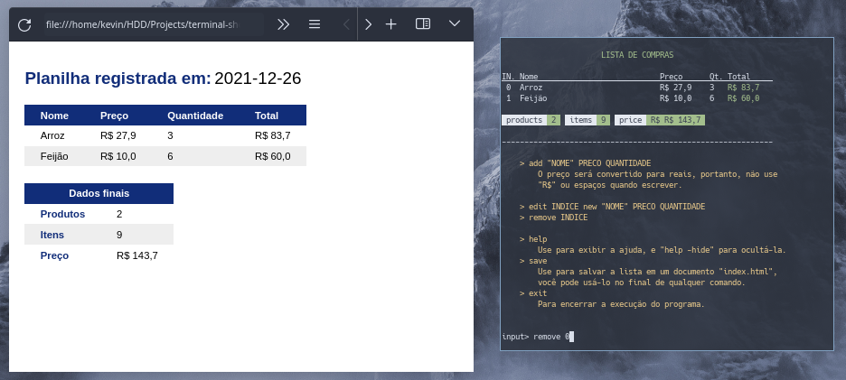

# Lista de Compras

Uma espécie de "shell" que você pode usar para registrar o preços de cada produto que você compra. Depois você vai ter a opção de salvar tudo em um documento HTML para futuras consultas. Rode o script em `src/run.py` e use o comando `help` para saber o que fazer.

Com esse projeto, eu estava querendo saber como o Python lida com arquivos externos...

  

